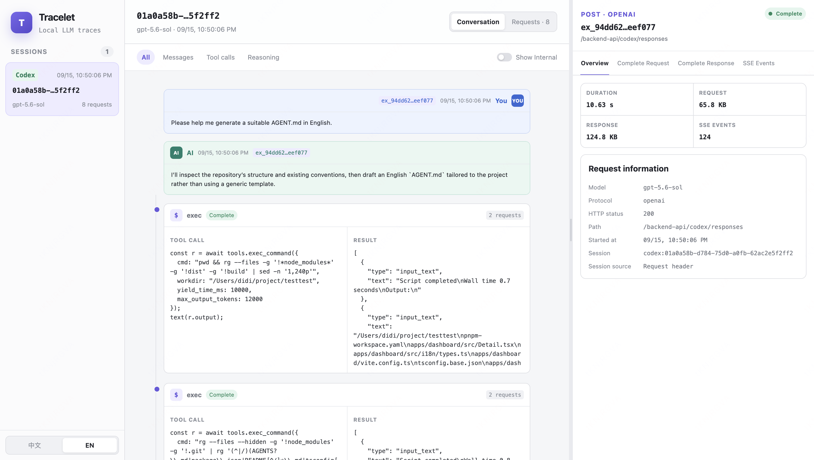
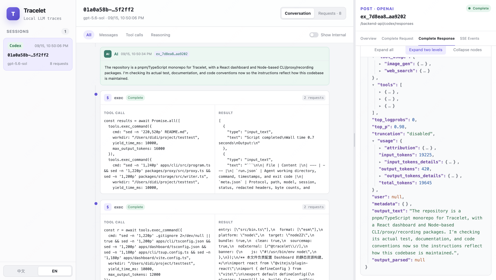
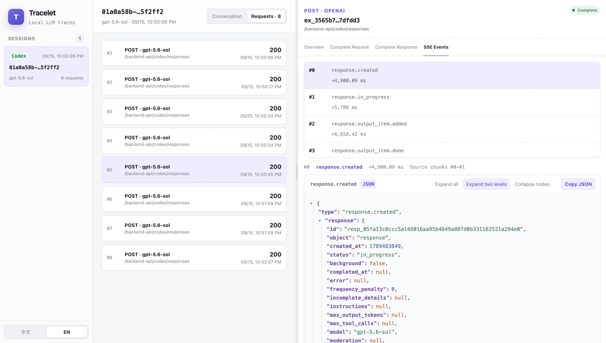

<!-- This file provides the English documentation for Tracelet. When modifying this file, the agent must update README.zh-CN.md at the same time to keep both versions consistent. -->

# Tracelet

Trace and inspect LLM traffic from Claude Code, Codex, and custom agents locally.

[简体中文](./README.zh-CN.md)

## Introduction

Tracelet is a TypeScript CLI that launches agents through a local HTTP proxy and records requests and streaming responses exchanged with the LLM. It does not change request payloads or permanently modify an agent's configuration.

The built-in Dashboard reconstructs conversations from the recorded traffic and lets you inspect messages, reasoning, tool calls, complete requests and responses, and SSE events. Records are stored locally in `~/.tracelet/data` by default.



## Installation

Tracelet requires Node.js 22 or later. To use a built-in agent, install and authenticate its `claude` or `codex` command.

Install the CLI globally:

```bash
npm install --global tracelet-cli
tracelet
```

Or run it without a global installation:

```bash
npx tracelet-cli
```

## Usage

Run Tracelet and select an Agent interactively:

```bash
tracelet
```

You can also start an Agent directly. Arguments after `--` are passed to the Agent unchanged:

```bash
tracelet claude
tracelet codex
tracelet codex -- --model gpt-5.6-sol
```

To trace another agent, choose **Manage custom agents...** from `tracelet`, or run `tracelet agent`. Add its executable, default arguments, protocol (Anthropic Messages or OpenAI Responses), and original upstream URL. Tracelet passes its local Base URL through `ANTHROPIC_BASE_URL` or `OPENAI_BASE_URL` by default; you can choose another environment variable or an argument template if the agent requires it. The upstream prompt defaults to that variable's current value when available. The agent must support the selected protocol and Base URL override.

The generated ID is shown after saving. Launch it from the main menu or directly:

```bash
tracelet run custom-my-agent -- --model example
```

The same menu supports editing and deleting custom agents. Configurations live in `~/.tracelet/settings.json`; deleting one keeps its recorded history.

The CLI prints the Dashboard URL after startup. To inspect existing records without launching an Agent, run:

```bash
tracelet dashboard
```





Other available commands:

```bash
tracelet proxy       # Configure system proxy usage for each Agent
tracelet agent       # Manage custom agents
tracelet clear       # Clear all recorded sessions
tracelet clear --yes # Clear without confirmation
```

Use `--port` to change the local server port and `--data-dir` to change the record directory. Shared options must appear before the subcommand:

```bash
tracelet --port 4318 --data-dir ./trace-data codex
```

Authorization headers are redacted before metadata is saved, but prompts, tool inputs, and model outputs can still contain sensitive information. Keep the data directory private.

## Local Development

The repository uses pnpm workspaces. Development requires Node.js 22 or later and pnpm 11.

```bash
pnpm install
pnpm dev
```

Run all checks and create a production build:

```bash
pnpm typecheck
pnpm test
pnpm build
```

Create a local global link for the `tracelet` command:

```bash
pnpm build
cd apps/cli
npm link
tracelet
```
